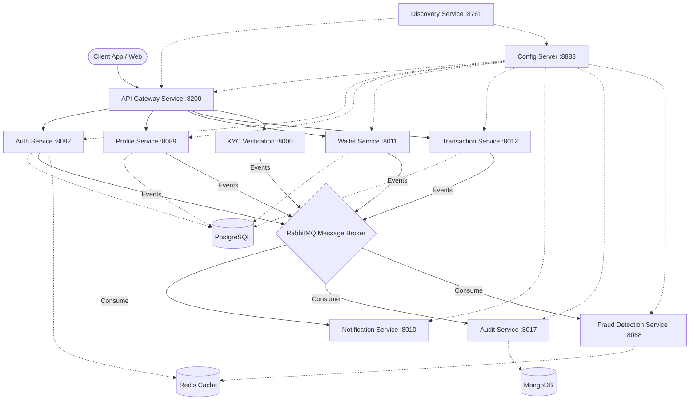

# Next-Gen Microservices Digital Wallet


A highly scalable, distributed, and secure Digital Wallet backend system built with **Spring Boot Microservices** and **Python FastAPI**. The system handles everything from user authentication and KYC verification (powered by AI), to secure transactions, wallet management, fraud detection, and asynchronous notifications.

---

## 🏗 System Architecture

The project follows a pure microservice architecture pattern. It utilizes **Spring Cloud** for service discovery, centralized configuration, and API routing. All inter-service communication is handled asynchronously via **RabbitMQ** to ensure high availability and loose coupling, with synchronous calls minimized.



---

## ✨ Key Features

- **Microservices Architecture:** Fully decoupled services bounded by domain.
- **Centralized Configuration:** Managed globally using Spring Cloud Config.
- **Dynamic Service Discovery:** Provided by Netflix Eureka.
- **API Gateway:** Single entry point for all client requests using Spring Cloud Gateway.
- **Event-Driven:** Heavy usage of RabbitMQ for asynchronous processing (Audits, Notifications, Status updates).
- **AI-Powered KYC:** Python/FastAPI based KYC verification using Gemini AI and Cloudinary.
- **🤖 DeepFace Face Verification:** Uses the `VGG-Face` model from **DeepFace** to compare a user's live selfie against their NID photo — enabling real biometric identity verification.
- **Security:** JWT-based authentication with Global Exception Handling.
- **Fraud Detection:** Real-time transaction monitoring and anomaly detection using Redis caching.
- **Audit Logging:** Centralized NoSQL (MongoDB) logging for compliance and tracking.
- **Containerized:** Fully deployable via Docker Compose.

---

## 🧩 Microservices Overview

| Service | Port | Description | Tech Stack |
| :--- | :--- | :--- | :--- |
| **Discovery Service** | `8761` | Eureka Server for dynamic service registration and discovery. | Spring Cloud Netflix Eureka |
| **Config Service** | `8888` | Centralized configuration server reading from local `config-repo`. | Spring Cloud Config |
| **Gateway Service** | `8200` | API Gateway handling routing, CORS, and request filtering. | Spring Cloud Gateway |
| **Auth Service** | `8082` | Handles User Signup, Login, JWT generation, OTP, and password resets. | Spring Boot, PostgreSQL, Redis |
| **Profile Service** | `8089` | Manages user profile information and links with Auth. | Spring Boot, PostgreSQL |
| **Wallet Service** | `8011` | Manages wallet balances and holds funds. | Spring Boot, PostgreSQL |
| **Transaction Service** | `8012` | Handles deposits, withdrawals, and P2P transfers. | Spring Boot, PostgreSQL |
| **Notification Service** | `8010` | Consumes messages to send Email/SMS notifications asynchronously. | Spring Boot, JavaMailSender |
| **Audit Service** | `8017` | Centralized tracking of all system events and user actions. | Spring Boot, MongoDB |
| **Fraud Detection** | `8088` | Monitors transactions for velocity and rules-based fraud anomalies. | Spring Boot, Redis |
| **KYC Verification** | `8000` | Validates user identity documents using AI models. | Python, FastAPI, Gemini AI |

---

## 🛠 Tech Stack

### Backend Technologies
* **Java 21** & **Spring Boot 3.2.x**
* **Python 3.11** & **FastAPI**
* **Spring Cloud** (Config, Netflix Eureka, Gateway)
* **Spring Security** (JWT Authentication)
* **Spring Data JPA** & **Hibernate**

### AI & Machine Learning
* **DeepFace** — Open-source face recognition framework
  * Model Used: **`VGG-Face`** (Oxford Visual Geometry Group model)
  * Purpose: Biometric verification — comparing a live user selfie against the NID photo to confirm identity
  * Runs as a blocking synchronous call inside an async executor (`loop.run_in_executor`) to avoid blocking the FastAPI event loop
  * Returns: `verified` (bool), `distance` (float), `threshold` (float)
* **Gemini AI** (Google) — Used for NID text extraction and document intelligence
* **Cloudinary** — Cloud storage for NID images and selfies

### Databases & Message Brokers
* **PostgreSQL 15** (Relational Data: Users, Wallets, Transactions)
* **MongoDB 6.0** (NoSQL Data: Audit Logs)
* **Redis 7** (Caching & Fraud rules)
* **RabbitMQ 3.12** (Message Broker & Event Streaming)

### DevOps & Tools
* **Docker & Docker Compose**
* **Maven / Poetry** (Dependency Management)

---

## Getting Started

### Prerequisites
Make sure you have the following installed:
- [Docker](https://www.docker.com/get-started) & Docker Compose
- Java 21 & Maven (for local non-docker builds)
- Python 3.11 (for KYC service development)

### 1. Environment Configuration

Create a `.env` file in the root of the project with your secrets:

```env
# Database Credentials
DB_USER=postgres
DB_PASSWORD=your_secure_password

# RabbitMQ Credentials
RABBIT_USER=guest
RABBIT_PASSWORD=guest

# SMTP Mail Secrets
MAIL_USER=your_email@gmail.com
MAIL_PASSWORD=your_app_password

# Core Secrets
JWT_SECRET_KEY=your_very_long_secure_jwt_secret_key_here

# Third-Party Integration Secrets
GEMINI_API_KEY=your_google_gemini_api_key
CLOUDINARY_CLOUD_NAME=your_cloud_name
CLOUDINARY_API_KEY=your_cloudinary_api_key
CLOUDINARY_API_SECRET=your_cloudinary_api_secret

# MongoDB Credentials
MONGO_INITDB_ROOT_USERNAME=admin
MONGO_INITDB_ROOT_PASSWORD=your_mongo_password
```

### 2. Run with Docker Compose

The entire stack is containerized. To spin up all databases, message brokers, and microservices at once, simply run:

```bash
docker compose up -d
```

### 3. Verify Running Services
You can verify that all 15+ containers are up and healthy using:
```bash
docker compose ps
```
- Eureka Dashboard: `http://localhost:8761`
- RabbitMQ Management UI: `http://localhost:15672` (guest/guest)
- API Gateway: `http://localhost:8200`

---

## 📡 API Endpoints (Gateway via `localhost:8200`)

All requests should be routed through the API Gateway running on port `8200`.

> **Legend:**
> - 🔓 Public — No authentication required
> - 🔐 Private — Requires `Authorization: Bearer <token>` header
> - 🔒 Internal — Service-to-service only (not exposed to clients)

---

### 🔐 Auth Service — `/api/v1/auth`

| Method | Endpoint | Auth | Description |
| :---: | :--- | :---: | :--- |
| `POST` | `/api/v1/auth/signup` | 🔓 | Register a new user account. Sends OTP via email. |
| `POST` | `/api/v1/auth/login` | 🔓 | Authenticate with phone number & password. Returns JWT token. |
| `POST` | `/api/v1/auth/verify-signup` | 🔓 | Verify email OTP to activate the account. |
| `POST` | `/api/v1/auth/resend-otp` | 🔓 | Resend the OTP to the registered email. |
| `POST` | `/api/v1/auth/forgot-password` | 🔓 | Initiate password reset flow. Sends a reset OTP to email. |
| `POST` | `/api/v1/auth/forgot-password/verify` | 🔓 | Verify forgot-password OTP. Returns a temporary reset token. |
| `POST` | `/api/v1/auth/reset-password` | 🔓 | Set a new password using the temporary reset token. |
| `GET` | `/internal/role/{userId}` | 🔒 | Internal endpoint: Get user role by ID (used by Gateway). |

---

### 👤 Profile Service — `/api/v1/profiles`

| Method | Endpoint | Auth | Description |
| :---: | :--- | :---: | :--- |
| `GET` | `/api/v1/profiles` | 🔐 | Get all user profiles (admin use). |
| `GET` | `/api/v1/profiles/me` | 🔐 | Get the logged-in user's own profile. |
| `PATCH` | `/api/v1/profiles/nid-submit` | 🔐 | Upload NID front & back images for KYC. Processed asynchronously via RabbitMQ. |
| `POST` | `/api/v1/profiles/upload-liveness` | 🔐 | Upload a selfie for liveness/face-match KYC verification. Powered by **DeepFace AI**. |

---

### 💰 Wallet Service — `/api/v1/wallets`

| Method | Endpoint | Auth | Description |
| :---: | :--- | :---: | :--- |
| `GET` | `/api/v1/wallets` | 🔐 | Get all wallets in the system (admin use). |
| `GET` | `/api/v1/wallets/me` | 🔐 | Get the logged-in user's wallet balance and details. |
| `DELETE` | `/api/v1/wallets/{id}` | 🔐 | Delete a wallet by its ID. |

---

### 💸 Transaction Service — `/api/v1/transactions`

| Method | Endpoint | Auth | Description |
| :---: | :--- | :---: | :--- |
| `GET` | `/api/v1/transactions` | 🔐 | Get all transactions in the system (admin use). |
| `GET` | `/api/v1/transactions/me` | 🔐 | Get all transactions for the logged-in user. |
| `POST` | `/api/v1/transactions` | 🔐 | Initiate a new transaction (deposit / withdrawal / transfer). Async processing. |
| `DELETE` | `/api/v1/transactions/{id}` | 🔐 | Delete a transaction record by its ID. |

---

### 📋 Audit Service — `/api/v1/audit`

> The Audit Service is **event-driven only**. It has no public-facing REST endpoints.
> All audit logs are written automatically when events are published to RabbitMQ from other services (e.g., User Signup, Login, Transaction events).

---

### 🤖 KYC Verification Service (FastAPI — internal port `:8000`)

> The KYC Service is **message-driven**. It listens for events from the `kyc.verification.requested.queue` RabbitMQ queue and has one health-check endpoint.

| Method | Endpoint | Auth | Description |
| :---: | :--- | :---: | :--- |
| `GET` | `/kyc-verification/test` | 🔓 | Health check for the KYC service. |

---


## 🛡 Exception Handling
The project implements a centralized `@RestControllerAdvice` (`GlobalExceptions.java`) that standardizes error responses across all microservices into a consistent JSON format:
```json
{
  "statusCode": 400,
  "success": false,
  "message": "Error description",
  "path": "/api/v1/auth/signup",
  "data": null,
  "errors": {
    "error": "Detailed error reason"
  },
  "timestamp": "2026-06-05T12:00:00.000"
}
```

---
## 🧩 Saga Pattern (Distributed Transactions)

The system implements the **Saga pattern** to achieve eventual consistency across microservices for critical operations like wallet creation, fund transfers, and profile updates. Each saga consists of a series of **local transactions** (executed by individual services) followed by **compensating actions** (rollback) in case of failure.

### How it works
1. **Orchestration** – The `Transaction Service` acts as the orchestrator, publishing events to RabbitMQ.
2. **Local actions** – Services (Auth, Profile, Wallet, Transaction, etc.) consume the event and perform their own database updates.
3. **Failure detection** – If a service encounters an error (e.g., insufficient balance, validation failure), it sends a **rollback message** to a dedicated rollback queue (`${rabbitmq.messaging.rollback-queue}`) using a routing key `${rabbitmq.messaging.rollback-routing-key}`.
4. **Compensation** – Other services listen on the rollback queue (`TransactionSagaConsumer`, `WalletServiceImpl`, `ProfileServiceImpl`, etc.) and execute compensating transactions to revert the changes, ensuring data consistency.

### Key components
- **Rollback Queues** – Defined per service (`rollback-queue`, `rollback-queue-profile`, etc.) in each `RabbitMQConfig.java`.
- **Rollback Routing Keys** – Shared routing key `${rabbitmq.messaging.rollback-routing-key}` used to route compensation messages.
- **Compensating Services** – Implemented in `WalletServiceImpl.sendRollbackMessage`, `ProfileServiceImpl`, and `TransactionSagaConsumer`.
- **Event‑driven communication** – All saga steps are asynchronous via RabbitMQ, providing resilience and loose coupling.

> The saga implementation enables the system to handle complex, multi‑service transactions without a centralized XA transaction manager, while still guaranteeing eventual consistency.

---
*Developed with using Spring Boot & Microservices Architecture.*
